<h1 align="center">SafeSymptom</h1>

<strong>AI-guided intake. Connected clinician workflows.</strong> 
<em>An independently developed, closed-source product demo.</em>

<a href="https://www.safesymptom.com/en-us"><strong>Explore the demo &nbsp; →</strong></a>

<a href="README.tr.md">Türkçe</a> &nbsp; / &nbsp;
<a href="#screenshots">Screenshots</a> &nbsp; / &nbsp;
<a href="#contact">Contact</a>

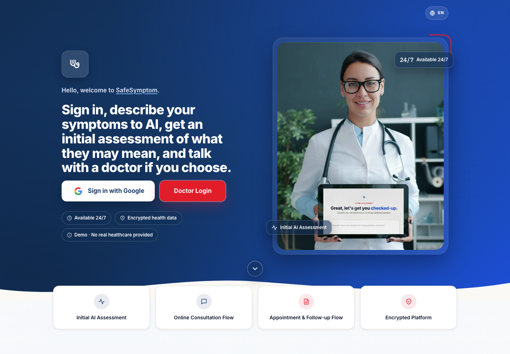

<strong>English + Turkish</strong> &nbsp; · &nbsp; Desktop + mobile &nbsp; · &nbsp; <strong>Source code stays private</strong>

## The idea

A symptom conversation is only part of a care workflow. **The context needs to travel with it.** SafeSymptom explores that connection in one application, from patient intake and assessment summaries to clinician chat and handoff.

<table width="100%" align="center">
<tr>
<td align="center" valign="middle">

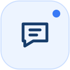

<strong>Guided conversation</strong> Follow-up questions collect context before an assessment is completed.

</td>
</tr>
<tr>
<td align="center" valign="middle">

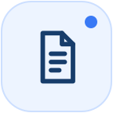

<strong>Structured context</strong> Summaries and urgency categories make the conversation reviewable.

</td>
</tr>
<tr>
<td align="center" valign="middle">

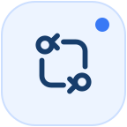

<strong>Connected handoffs</strong> Linked conversations preserve their authors and history across transfers.

</td>
</tr>
</table>

> **Demo scope:** For adults 18+ testing fictional scenarios only. SafeSymptom does not diagnose or provide real healthcare. Doctor, appointment, and prescription workflows are demonstrations. Do not enter real health information, patient identifiers, or medical documents. For emergencies, contact your local emergency service.

## A look inside

*Public pages are captured from the hosted demo. Signed-in screens use the real interface with local, fictional test data. Chat text is scripted for illustration, not a recorded model evaluation.* [Screenshot notes](SCREENSHOTS.md)

### 01 · Patient conversation

Follow-up questions keep a fictional scenario in context before an assessment is completed.

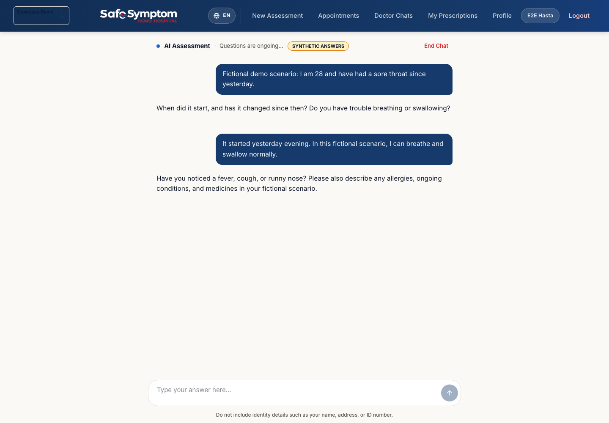

&nbsp; &nbsp; <strong>View the mobile conversation</strong>

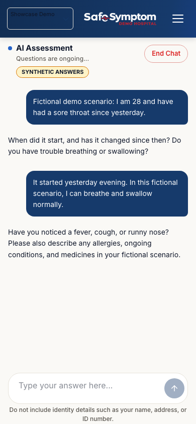

### 02 · Clinician history and handoff

**A handoff should not erase the conversation that came before it.** The clinician workspace brings together reports, patient history, chat, and notes with role-scoped access. This read-only example preserves the destination doctor and transfer time using fictional test identities.

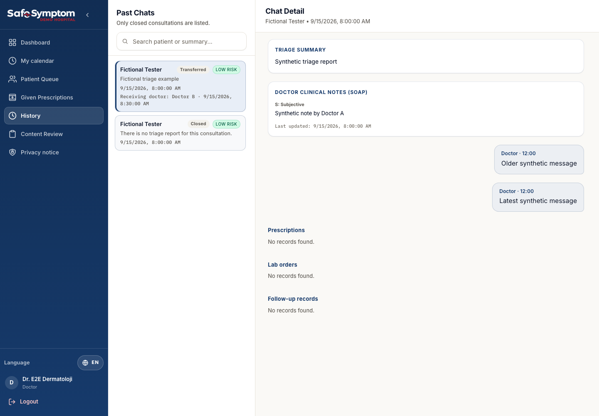

### 03 · Privacy choices

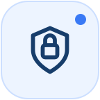

<strong>Export, consent withdrawal, and deletion requests are separate actions.</strong>

&nbsp; &nbsp; <strong>Explore the Privacy Center</strong>

*This local fixture shows withdrawn consent. The other privacy controls remain available.*

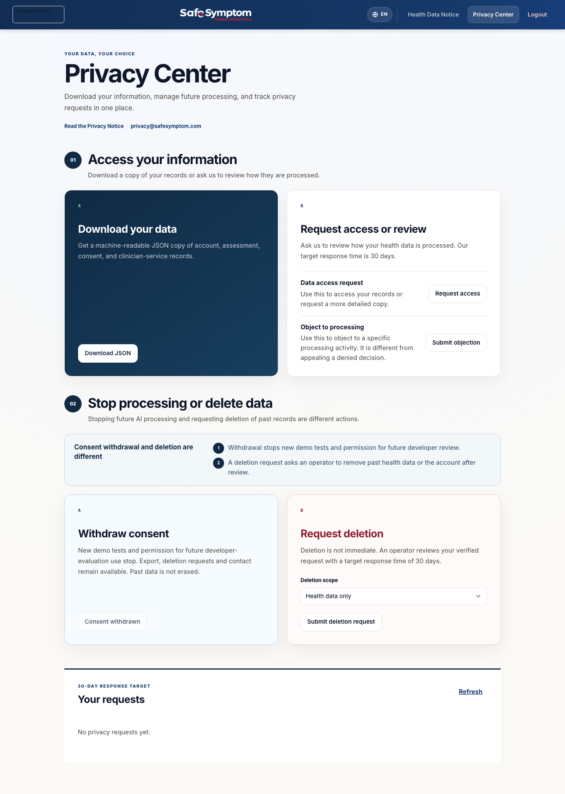

## Try the hosted demo

1. **Open [SafeSymptom](https://www.safesymptom.com/en-us).**
2. **Sign in with Google** and review eligibility, the privacy notice, and the terms.
3. **Use an invented scenario only.** Your Google account information is still real; its handling is described in the Privacy Notice.

Model usage is limited, and the demo may be unavailable during maintenance or when limits are reached. Clinician access is separately authorized; a patient sign-in does not grant access to the clinician workspace. No real clinician availability or consultation is promised.

[Privacy Notice](https://www.safesymptom.com/privacy) · [Terms of Use](https://www.safesymptom.com/terms) · [Privacy Center](https://www.safesymptom.com/privacy-center)

## Engineering focus

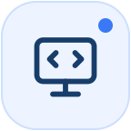

<strong>TypeScript · Next.js · PostgreSQL / Supabase</strong> Server-side AI integration

- **Continuity:** durable conversation state and connected transfer history.
- **Controlled access:** role-scoped clinical workflows and explicit consent.
- **Data protection:** selective application-level encryption and recoverable background processing.
- **Usability:** bilingual, responsive patient and clinician interfaces.

*This is an independent platform. No live Epic/FHIR integration, clinical validation, or regulatory certification is claimed. UI screenshots and software tests do not establish medical accuracy.*

## Source and ownership

Created and developed by **Alhan Akdemir**.

**This is a product showcase, not an open-source release.** It contains documentation, screenshots, and visual assets only. The application source code remains private; no MIT or other open-source software license is granted.

Copyright © 2026 Alhan Akdemir. See [LICENSE](LICENSE) for the proprietary notice, limited promotional sharing, and third-party-rights exceptions. Public GitHub materials can be viewed and forked under GitHub's terms; this does not grant an application-source license.

## Get in touch

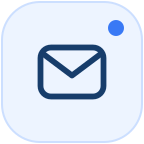

<strong>Feedback, collaboration, or a question?</strong>

<strong>Support &amp; collaboration</strong> Feedback, technical problems, and project enquiries <a href="mailto:support@safesymptom.com">support@safesymptom.com</a>

<strong>Privacy</strong> Privacy and personal-data requests <a href="mailto:privacy@safesymptom.com">privacy@safesymptom.com</a>

<strong>Security</strong> <a href="SECURITY.md">Private reporting guidance</a>

&nbsp; &nbsp; <strong>View the current Contact section</strong>

The current Contact section offers support and privacy email links. An in-app support form is not part of the current demo.

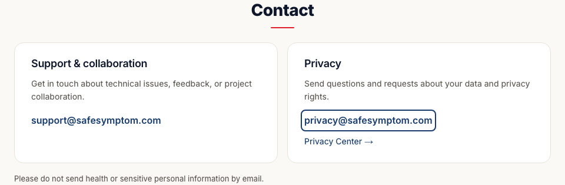

**Please do not send health information, credentials, or sensitive personal information by email or in public GitHub discussions.**
