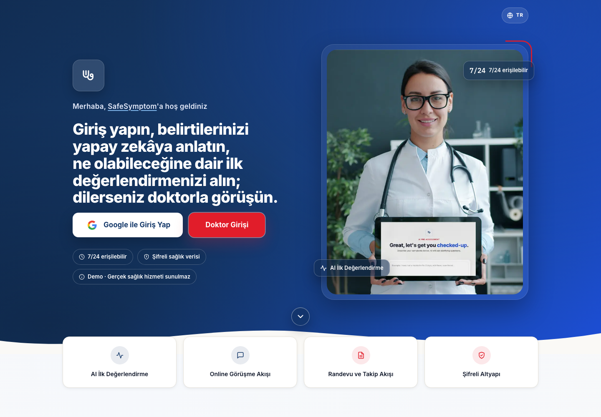
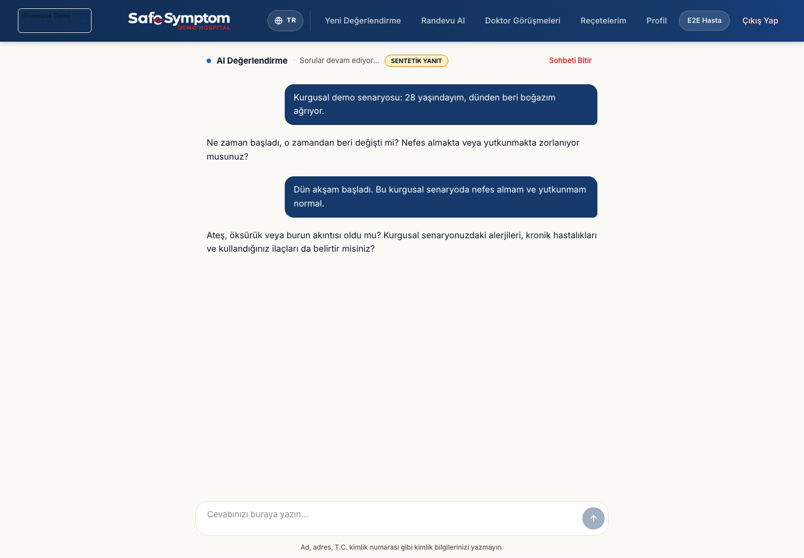
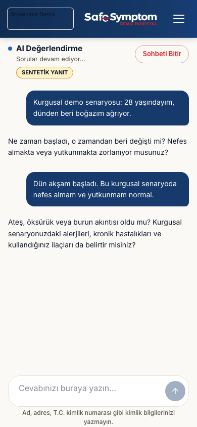
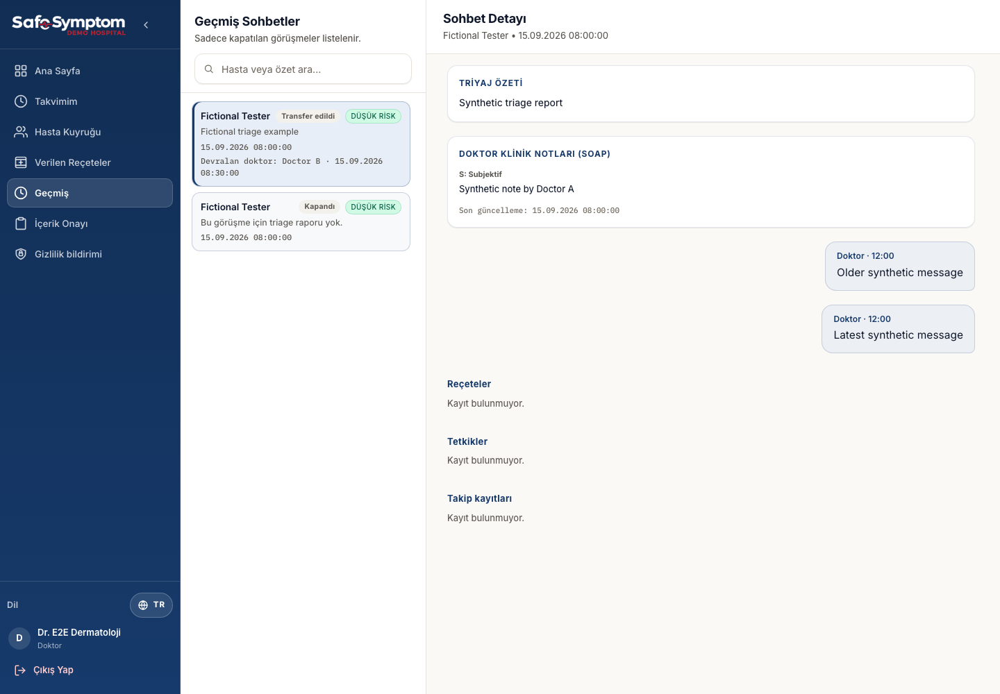
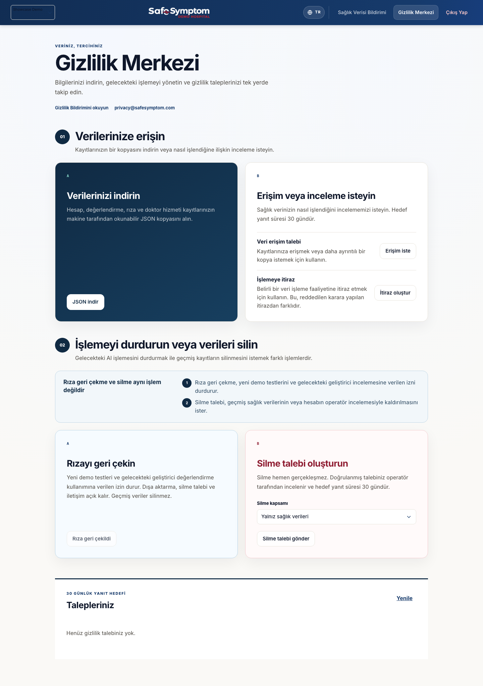
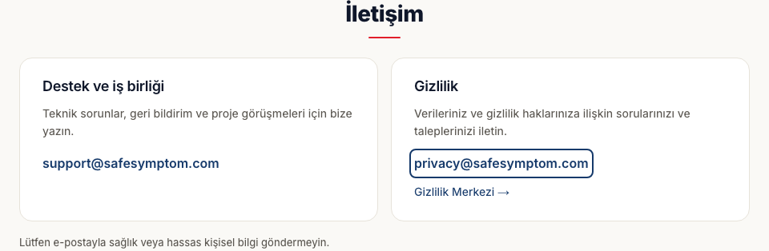

<h1 align="center">SafeSymptom</h1>

<strong>AI destekli ilk değerlendirme. Birbirine bağlı doktor iş akışları.</strong> 
<em>Bağımsız geliştirilen, kapalı kaynak bir ürün demosu.</em>

<a href="https://www.safesymptom.com"><strong>Demoyu incele ↗</strong></a>
&nbsp; · &nbsp; <a href="README.md">English</a>
&nbsp; · &nbsp; <a href="#screenshots">Ekran görüntüleri</a>
&nbsp; · &nbsp; <a href="#contact">İletişim</a>

<strong>Türkçe + İngilizce</strong> &nbsp; · &nbsp; Masaüstü + mobil &nbsp; · &nbsp; <strong>Kaynak kod gizli kalır</strong>

## Çıkış noktası

Semptom sohbeti, bir sağlık iş akışının yalnızca bir parçasıdır. **Toplanan bağlamın sonraki aşamalara da taşınması gerekir.** SafeSymptom bu bağlantıyı tek bir uygulamada araştırıyor: hasta girişi ve değerlendirme özetlerinden doktor sohbetine ve aktarıma kadar.

<table>
<tr>
<td width="72" align="center"></td>
<td><strong>Yönlendirmeli sohbet</strong> Takip soruları, değerlendirme tamamlanmadan önce senaryonun bağlamını toplar.</td>
</tr>
<tr>
<td width="72" align="center"></td>
<td><strong>Yapılandırılmış bilgi</strong> Özetler ve aciliyet kategorileri, sohbeti incelenebilir bir biçime taşır.</td>
</tr>
<tr>
<td width="72" align="center"></td>
<td><strong>Bağlantılı aktarım</strong> Doktorlar arası aktarımda görüşmelerin yazarları ve geçmişi korunur.</td>
</tr>
</table>

> **Demo kapsamı:** Yalnızca 18 yaş ve üzeri kullanıcıların kurgusal senaryoları test etmesi içindir. SafeSymptom teşhis koymaz veya gerçek sağlık hizmeti sunmaz. Doktor, randevu ve reçete akışları tanıtım amaçlıdır. Gerçek sağlık bilgisi, hasta kimliği veya tıbbi belge girmeyin. Acil durumlarda bulunduğunuz yerin acil yardım hizmetine başvurun.

## Uygulamadan görüntüler

*Herkese açık sayfalar canlı demodan alınmıştır. Giriş gerektiren ekranlarda gerçek arayüz, yerel ve kurgusal test verileriyle gösterilir. Sohbet metni örnek amaçlı yazılmıştır; kaydedilmiş bir model değerlendirmesi değildir.* [Görüntüler nasıl hazırlandı?](SCREENSHOTS.md)

### 01 · Hasta sohbeti

Takip soruları, değerlendirme tamamlanmadan önce kurgusal senaryonun bağlamını toplar.

<strong>Mobil sohbeti görüntüle</strong>

### 02 · Doktor geçmişi ve aktarım

**Aktarım, önceki görüşmenin bağlamını kaybettirmemeli.** Doktor çalışma alanı; raporları, hasta geçmişini, sohbeti ve notları rol bazlı erişimle bir araya getirir. Bu salt okunur örnekte hedef doktor ve aktarım zamanı kurgusal test kimlikleriyle gösterilir.

### 03 · Gizlilik tercihleri

 &nbsp; **Dışa aktarma, izni geri çekme ve silme talebi ayrı işlemlerdir.**

<strong>Gizlilik Merkezi'ni incele</strong>

*Bu yerel testte izin geri çekilmiştir. Diğer gizlilik kontrolleri erişilebilir kalır.*

## Canlı demoyu deneyin

1. **[SafeSymptom'u](https://www.safesymptom.com) açın.**
2. **Google ile giriş yapın;** katılım koşullarını, aydınlatma metnini ve kullanım koşullarını inceleyin.
3. **Yalnızca uydurulmuş bir senaryo kullanın.** Google hesap bilgileriniz yine gerçektir; bu bilgilerin işlenmesi Gizlilik Bildirimi'nde açıklanır.

Model kullanımı sınırlıdır; bakım veya kullanım sınırları nedeniyle demo geçici olarak erişilemeyebilir. Doktor erişimi ayrıca yetkilendirilir; hasta girişi doktor çalışma alanına erişim sağlamaz. Gerçek doktor bulunabilirliği veya görüşmesi vaat edilmez.

[Gizlilik Bildirimi](https://www.safesymptom.com/privacy) · [Kullanım Koşulları](https://www.safesymptom.com/terms) · [Gizlilik Merkezi](https://www.safesymptom.com/privacy-center)

## Teknik odak

 &nbsp; **TypeScript · Next.js · PostgreSQL / Supabase · Sunucu taraflı AI entegrasyonu**

- **Süreklilik:** kalıcı sohbet durumu ve bağlantılı aktarım geçmişi.
- **Kontrollü erişim:** rol bazlı klinik iş akışları ve açık onay.
- **Veri koruma:** seçili alanların uygulama düzeyinde şifrelenmesi ve kesintiden sonra devam edebilen arka plan işlemleri.
- **Kullanılabilirlik:** iki dil ve farklı ekranlara uyumlu hasta/doktor arayüzleri.

*SafeSymptom bağımsızdır. Canlı Epic/FHIR entegrasyonu, klinik doğrulama veya mevzuat sertifikasyonu iddiası yoktur. Arayüz görüntüleri ve yazılım testleri tıbbi doğruluk kanıtı değildir.*

## Kaynak kod ve haklar

Projenin sahibi ve geliştiricisi **Alhan Akdemir**'dir.

**Bu bir ürün tanıtımıdır, açık kaynak yayını değildir.** Repo yalnızca belgeler, ekran görüntüleri ve görsel öğeler içerir. Uygulamanın kaynak kodu gizli kalır; MIT veya başka bir açık kaynak yazılım lisansı verilmez.

Copyright © 2026 Alhan Akdemir. Özel hak bildirimi, sınırlı tanıtım paylaşımı ve üçüncü taraf haklarına ilişkin istisnalar için [LICENSE](LICENSE) dosyasına bakın. Herkese açık GitHub dosyaları GitHub koşulları kapsamında görüntülenebilir ve fork edilebilir; bu, uygulama kaynak koduna lisans verildiği anlamına gelmez.

## İletişim

 &nbsp; **Geri bildirim, iş birliği veya bir sorunuz mu var?**

| Konu | İletişim |
| :--- | :--- |
| Geri bildirim, teknik sorunlar, iş birliği | [support@safesymptom.com](mailto:support@safesymptom.com) |
| Gizlilik ve kişisel veri talepleri | [privacy@safesymptom.com](mailto:privacy@safesymptom.com) |
| Güvenlik sorunları | [Özel bildirim yönergeleri](SECURITY.md) |

<strong>Mevcut İletişim bölümünü görüntüle</strong>

Mevcut İletişim bölümü destek ve gizlilik e-posta bağlantıları sunar. Uygulama içi destek formu henüz mevcut demoda yer almaz.

**E-posta veya herkese açık GitHub tartışmalarında sağlık bilgisi, erişim anahtarı ya da hassas kişisel bilgi paylaşmayın.**
